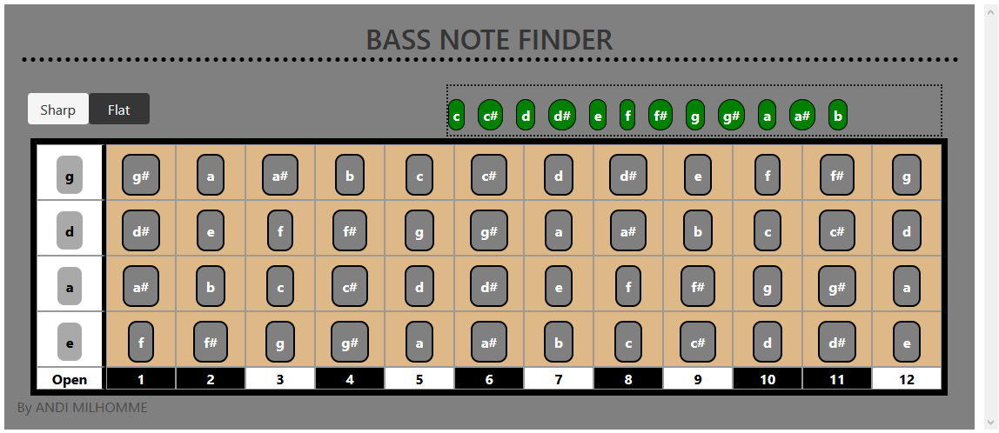

# Bassngx
This is my coolest project so far. 
It useful and still in the experimental phase. 
Most of the challenges are UX based. 

How can I make this usable
## Ideas
* Voice commands
* Keyboard shortcuts?

## Technical
------------------------------------
## Development server
This is an Angular application, it uses angular 
This project was generated with [Angular CLI](https://github.com/angular/angular-cli) version 6.1.2.
You will also need to have nodejs/ npm installed on your machine

Run `ng serve` for a dev server. Navigate to `http://localhost:4200/`. The app will automatically reload if you change any of the source files.

